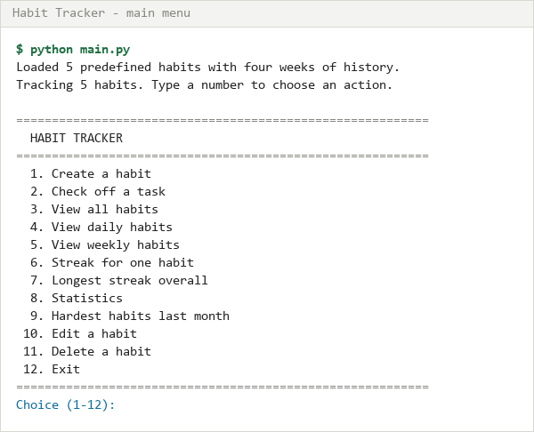
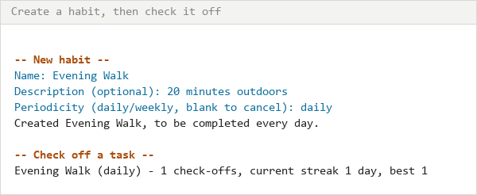
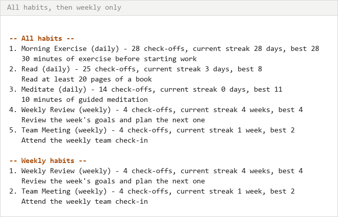
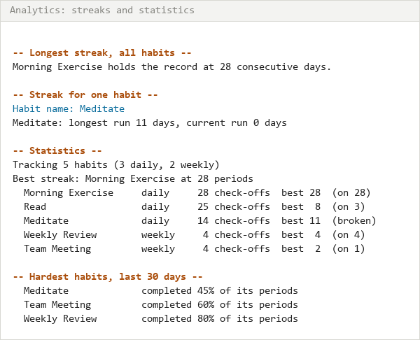
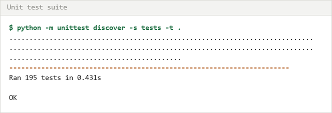

# Habit Tracker

A command-line habit tracker written in Python. You define habits, check them off as you do
them, and the app works out how long you have kept each one going.

Built for the IU portfolio course *Object-Oriented and Functional Programming with Python*
(DLBDSOOFPP01). The domain is modelled with classes; the analytics that read those classes are
written as pure functions.



## What it does

A habit is a task plus a period. "Read 20 pages" is a daily habit; "review the week's goals" is
a weekly one. Check a habit off at least once inside its period and the streak grows. Let a
whole period go by without checking it off and the streak breaks.

The period is the unit of the streak, which is the one design decision everything else follows
from. Checking a weekly habit off on Monday, Wednesday and Friday is one week of streak, not
three. Checking a daily habit off twice on Tuesday is one day. A daily streak counts days, a
weekly streak counts weeks, and the two are never mixed up.

There is also a difference between the streak you are on and the best you have ever done. The
app reports both. Lapsing on a habit sets the current streak to zero but leaves the record
standing, which is the figure most people actually want to see.

## Requirements

Python 3.10 or later. Nothing else. No third-party packages are used at runtime or in the tests,
so there is nothing to install.

Check your version with:

```bash
python --version
```

## Installing and running

```bash
git clone https://github.com/Mystique1337/oofpp_habits_project.git
cd oofpp_habits_project
python main.py
```

On the first run there is no data file, so the app writes one containing five predefined habits
with four weeks of history each. That gives you something to look at before you have entered
anything yourself. Every later run picks up the file where you left it.

Two options are available:

| Option | Effect |
| --- | --- |
| `--data-file PATH` | Keep habits somewhere other than `habits_data.json` |
| `--reset` | Overwrite the data file with the five predefined habits again |

`--reset` throws away whatever is in the file, so point it at a scratch path if you want to
experiment without losing anything:

```bash
python main.py --data-file demo.json --reset
```

## Using it

Pick actions by number. Everything is prompted, and a blank answer backs out of most prompts.

### Creating a habit and checking it off

Choose **1**, then give a name, an optional description, and either `daily` or `weekly`. Choose
**2** and name the habit to record a completion, stamped with the current date and time.



Checking a habit off twice inside one period is allowed, and the app says so rather than
silently inflating the count. Both check-offs are kept in the log; only one of them counts
toward the streak.

### Looking at what you are tracking

Option **3** lists everything. Options **4** and **5** narrow that to daily or weekly habits.



### Analysing

Options **6** to **9** cover the analytics. Option **6** reports both streak figures for one
habit, **7** finds the best run any habit has managed, **8** prints a table of everything, and
**9** ranks the habits you completed least often over the last 30 days.



In that screenshot Meditate shows a best run of 11 days but a current run of 0, because the
seeded data has it lapsing partway through. Team Meeting has four check-offs but a best streak
of two, because two of those four fall in the same week.

Options **10** and **11** edit and delete habits. Editing keeps the completion history, so
renaming a habit or switching it from daily to weekly does not throw away what you have already
done. Deleting asks for confirmation first, since it takes the history with it.

## How it is put together

```
main.py              Entry point: builds the storage, tracker and CLI and starts the loop
models/              The domain
  habit.py             Habit: a task, a period, and the log of times it was done
  completion.py        Completion: one check-off, as an ISO date and time
  periodicity.py       Periodicity: daily or weekly, and how each maps a date to a period
  tracker.py           HabitTracker: owns the habits and keeps storage in step
storage/
  json_storage.py      Reading and writing the JSON data file
analytics/
  metrics.py           Pure functions over habits: lists, filters, streaks, rankings
cli/
  interface.py         The menu loop, prompting and formatting
fixtures/
  seed_data.py         The five predefined habits and their four weeks of check-offs
tests/                 The unit test suite
```

Each layer only knows about the one below it. The CLI calls the tracker and the analytics
module; neither of those knows a terminal exists. That is what would let a web or desktop front
end replace `cli/` without touching anything else, and it is why the analytics functions can be
tested by handing them a list of habits with no application running.

### Object-oriented and functional, and why the split falls where it does

The domain is stateful. A habit accumulates completions, and it is the habit that knows how to
read them, so `Habit` owns both its event log and the streak calculation over it. That is a
natural fit for classes.

Analytics is not stateful. Every question the brief asks ("what is my longest streak?", "which
of my habits are daily?") is a value derived from habits that are already in memory. So
`analytics/metrics.py` holds pure functions: habits in, a new value out, nothing mutated and
nothing written. The tests check that literally, by snapshotting the habits before a call and
comparing afterwards.

### How streaks are calculated

Each periodicity maps a date to an integer index for the period it falls in, and two periods are
consecutive exactly when their indices differ by one. For a daily habit the index is the day
itself. For a weekly habit it is derived from the Monday that starts the week, so a Sunday and
the following Monday land in different weeks.

That turns both streak questions into arithmetic on a sorted set of integers. The longest streak
is the longest run of consecutive indices anywhere in the history. The current streak is the run
ending at the current period or the one before it, which is what stops today's task counting
against you before the day is over: a daily habit checked off yesterday but not yet today is
still on its streak.

Because the periodicity answers `period_index` itself, adding a monthly or yearly period would
mean adding one enum member and one line of arithmetic. Nothing in `Habit` or in the analytics
module would change.

### Storage

Habits are kept in a single JSON file, `habits_data.json`, written whenever anything changes.
JSON was chosen over SQLite because the data is small and stays readable, which matters for a
project someone else has to open and understand. Saves are written to a temporary file and moved
into place, so an interrupted write cannot leave you with half a file where your history was.

A file that exists but cannot be parsed is reported as an error rather than treated as "no
habits yet", which would quietly discard the real data on the next save.

`JsonStorage` exposes only `load` and `save`. Swapping in a SQLite backend means writing a class
with those two methods and passing it to `HabitTracker`.

## The predefined habits

Five habits ship with the app, three daily and two weekly, each with 28 days of history. The
patterns are built to exercise different parts of the streak logic rather than to look tidy:

| Habit | Period | Best streak | Current | What it covers |
| --- | --- | --- | --- | --- |
| Morning Exercise | daily | 28 | 28 | An unbroken run across the whole window |
| Read | daily | 8 | 3 | Scattered misses, so the best run sits mid-history |
| Meditate | daily | 11 | 0 | A habit that lapsed: current and best diverge |
| Weekly Review | weekly | 4 | 4 | One check-off in each of four consecutive weeks |
| Team Meeting | weekly | 2 | 1 | A skipped week, and two check-offs inside one week |

The data is generated by `fixtures/seed_data.py` rather than stored as a literal file, because it
has two jobs. Running the app, it ends on today, so the habits look live. Running the tests, it
ends on a fixed date, which keeps the expected streaks in the table above constant instead of
drifting with the calendar.

The weekly patterns are anchored to the Monday of the end date's week, so they hold whatever
weekday the app is run on. One of the tests builds the fixture on all seven weekdays and checks
the streaks come out the same each time.

## Running the tests

```bash
python -m unittest discover -s tests -t . -v
```



Or with `pytest`, if you have it, which collects the same tests unchanged:

```bash
pip install pytest
pytest
```

The suite has 195 tests across five files:

| File | Covers |
| --- | --- |
| `test_habit.py` | Creating, editing and serialising habits; daily and weekly streaks |
| `test_tracker.py` | Creating, editing, deleting and finding habits; write-through to storage |
| `test_storage.py` | Save and load round trips, and what happens to a corrupt file |
| `test_analytics.py` | One class per analytics function, plus a purity check on each |
| `test_cli.py` | The menu driven end to end with scripted keystrokes |

Each test builds its own habits from a fixed date and writes to a temporary file, so the suite
never touches your own `habits_data.json` and the order the tests run in does not matter.

The streak tests are the ones worth reading. They build their check-off patterns in the test
itself rather than reusing the fixture, so when one fails the pattern that broke it is visible
without opening another file.

## Analytics reference

Every function below is pure and takes any iterable of habits, so a `HabitTracker` can be passed
straight in.

| Function | Returns |
| --- | --- |
| `all_habit_names(habits)` | Names of every tracked habit |
| `habits_by_periodicity(habits, periodicity)` | The habits with one periodicity |
| `habit_names_by_periodicity(habits, periodicity)` | The same, as names |
| `longest_streak_all(habits)` | `(name, streak)` for the best run across all habits |
| `longest_streak_for(habits, name)` | One habit's best run |
| `current_streaks(habits, today=None)` | Name to current run, for every habit |
| `completion_totals(habits)` | Name to raw check-off count |
| `completion_rate(habit, since, until=None)` | Share of periods in a window that were completed |
| `struggled_most_since(habits, since, until=None, limit=3)` | Worst completion rates, worst first |
| `summarise(habits, today=None)` | Everything the statistics screen shows, as one dict |

The first four are the minimum the brief asks for. The rest exist because the brief also raises
questions a user would want answered, in particular which habits someone struggled with over the
past month, which `struggled_most_since` covers.

Functions that depend on the date take a `today` argument. It defaults to the real date, and the
tests pass it explicitly so their results do not move.

## Data format

```json
{
  "version": 1,
  "habits": [
    {
      "name": "Read",
      "description": "Read at least 20 pages of a book",
      "periodicity": "daily",
      "created_at": "2026-02-05T08:00:00",
      "completions": [
        { "date": "2026-03-03", "time": "21:30:00" },
        { "date": "2026-03-04", "time": "21:30:00" }
      ]
    }
  ]
}
```

Data written by an earlier version of the app, which named the field `created_date`, still loads.

## Author

Emmanuel Ashinze.
Written for DLBDSOOFPP01 at IU International University of Applied Sciences.
